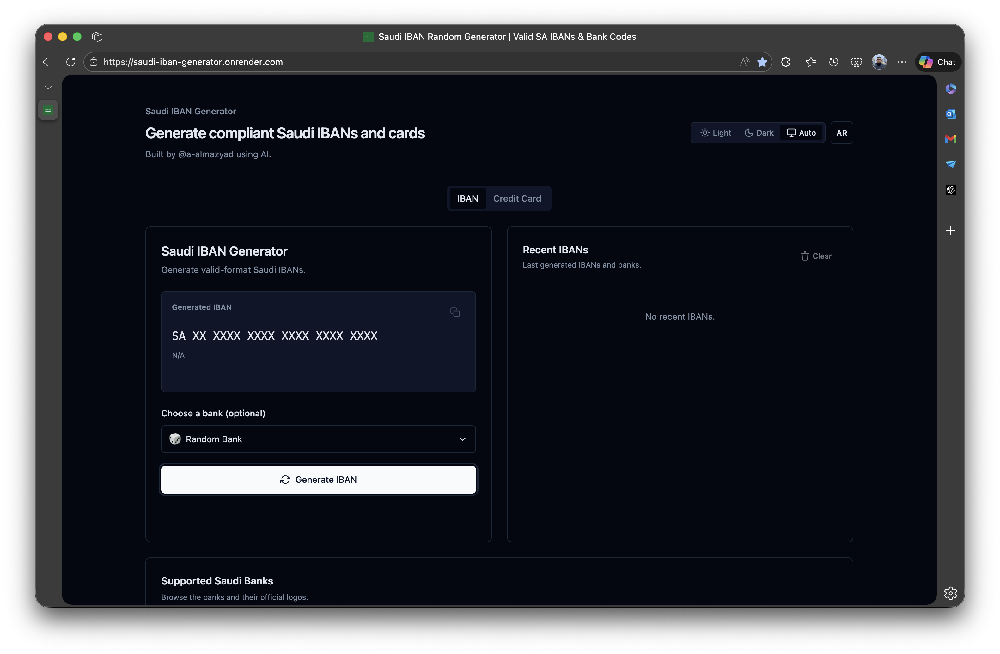

# 🇸🇦 Generador de IBAN de Arabia Saudita


🔗 [Demo en Vivo](https://saudi-iban-generator.onrender.com/)

Genere IBANs saudíes conformes y datos de muestra de tarjetas Visa saudíes en una aplicación web estática y rápida. La interfaz de usuario incluye selección de banco con logotipos, acciones de copiar al portapapeles, soporte bilingüe (EN/AR) y un tema limpio en modo oscuro/claro.

## ✨ Características

- 🔢 Generación de **IBANs saudíes** con formato válido y dígitos de control correctos
- 🏦 Selección de banco o aleatorización del código bancario (con logotipos)
- 🧠 Detección y visualización automática del **nombre del banco**
- 📋 **Copiar al portapapeles** con un solo clic y notificación toast
- 🕓 Almacenamiento y visualización de **IBANs recientes** y **tarjetas recientes** (localStorage)
- 🌙 **Modo oscuro/claro** con preferencia del sistema y alternador manual
- 🌐 **Inglés y Árabe** con cambio de dirección de lectura (RTL)
- 🎨 Interfaz animada utilizando **Tailwind CSS (CDN)** + **Alpine.js (CDN)**
- 💳 Generación de **números de tarjeta Visa saudíes** válidos (verificación Luhn)
- 🗂️ Interfaz por pestañas para los generadores de IBAN y de tarjetas

## 🖼️ Vista Previa



## 🎈 Uso

### Generador de IBAN
1. Seleccione un banco (o mantenga la selección aleatoria).
2. Haga clic en **Generate IBAN** para crear un nuevo IBAN saudí.
3. Presione **Copy** para copiar el IBAN a su portapapeles.
4. Los IBANs generados se guardan en su historial.

### Generador de Tarjetas de Crédito
1. Cambie a la pestaña **Credit Card**.
2. Haga clic en **Generate Card** para crear un número de Visa saudí con fecha de vencimiento y CVV.
3. Presione **Copy** para copiar el número de tarjeta a su portapapeles.
4. Las tarjetas generadas se guardan en su historial de tarjetas.

---

## 🛠️ Cómo Funciona

- **Generación de IBAN**
  - Construye un BBAN a partir del código bancario seleccionado + un número de cuenta aleatorio.
  - Calcula los dígitos de control utilizando el algoritmo **modulo 97**.
  - Formatea el IBAN final como `SA + dígitos de control + BBAN`.
- **Generación de tarjetas**
  - Produce un número de tarjeta Visa que satisface la suma de comprobación **Luhn**.
  - Genera una fecha de vencimiento realista y un CVV de 3 dígitos.
- **Estado y persistencia**
  - El estado de la interfaz y el historial se almacenan en **localStorage** para una recuperación rápida.

---

## 🌍 Localización y Accesibilidad

- Interfaz de usuario en inglés y árabe con cambio a RTL.
- La preferencia de idioma se persiste en localStorage.
- Los controles interactivos incluyen manejadores de teclado y etiquetas accesibles.

---

## 🧰 Stack Tecnológico

- **Frontend**: HTML, Tailwind CSS (CDN), Alpine.js (CDN)
- **Bundling**: Script de Node.js para exponer la utilidad de tarjeta de crédito en el navegador
- **Pruebas**: Jest (para los módulos auxiliares en `src/`)
- **Despliegue**: Hosting estático (no requiere backend)

---

## 📁 Estructura del Proyecto

```text
public/          # Activos del sitio estático (index.html, logos, creditCard.js compilado)
src/             # Módulos auxiliares (generador de tarjetas)
scripts/         # Script de construcción para empaquetar el ayudante de creditCard para el navegador
tests/           # Pruebas de Jest para la lógica del generador
```

---

## ▶️ Ejecución Local

```bash
cd public
python3 -m http.server 8080
# Luego abra http://localhost:8080 en su navegador
```

O abra `public/index.html` directamente.

---

## 🧪 Pruebas y Empaquetado

Ejecute `npm test` para ejecutar la suite de Jest. Los módulos auxiliares en `src/` son archivos CommonJS utilizados principalmente para estas pruebas.

Para hacer disponible el generador de tarjetas de crédito en el navegador, ejecute:

```bash
npm run build
```

Esto empaqueta `src/creditCard.js` en `public/creditCard.js` y expone un objeto global `CreditCard` utilizado por la interfaz de usuario.

---

## 🚀 Opciones de Despliegue

Esta es una aplicación estática. Puede desplegarla con:

- GitHub Pages
- Netlify
- Render
- Vercel

### Configuración de Despliegue

#### 🔹 Render
- Tipo: Static Site
- Comando de construcción: *(dejar en blanco)*
- Directorio de publicación: `public`

#### 🔹 GitHub Pages
- Use la carpeta `public` como fuente
- Recomendado: rama `gh-pages` o GitHub Actions

#### 🔹 Netlify
- Comando de construcción: *(dejar en blanco)*
- Directorio de publicación: `public`

#### 🔹 Vercel
- Directorio de salida: `public`
- Preset: Other

---

## 🤝 Contribución

¡Las contribuciones son bienvenidas! Si tiene sugerencias, mejoras o correcciones de errores, por favor haga un fork del repositorio y abra un pull request.

1. Haga fork de este repositorio
2. Cree una rama: `git checkout -b feature/TuFuncionalidad`
3. Haga commit de sus cambios: `git commit -m 'Agrega tu mensaje'`
4. Suba los cambios a su rama: `git push origin feature/TuFuncionalidad`
5. Abra un pull request

Por favor, asegúrese de que su código esté limpio y siga el estilo existente.
