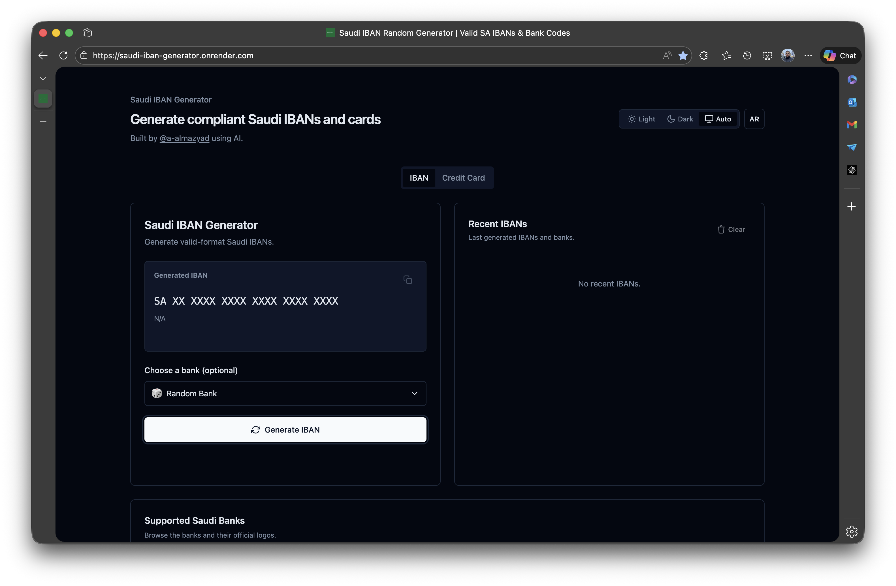

# 🇸🇦 Saudi IBAN Generator


🔗 [Live Demo](https://saudi-iban-generator.onrender.com/)

Generate compliant Saudi IBANs and sample Saudi Visa card details in a fast, static web app. The UI includes bank selection with logos, copy-to-clipboard actions, bilingual support (EN/AR), and a clean dark/light theme.

## ✨ Features

- 🔢 Generate valid-format **Saudi IBANs** with correct check digits
- 🏦 Select a bank or randomize the bank code (with logos)
- 🧠 Auto-detect and display **bank name**
- 📋 One-click **copy to clipboard** with toast feedback
- 🕓 Store and display **recent IBANs** and **recent cards** (localStorage)
- 🌙 **Dark/light mode** with OS preference and manual toggle
- 🌐 **English & Arabic** with RTL switching
- 🎨 Animated UI using **Tailwind CSS (CDN)** + **Alpine.js (CDN)**
- 💳 Generate valid **Saudi Visa card numbers** (Luhn check)
- 🗂️ Tabbed interface for IBAN and card generators

## 🖼️ Preview



## 🎈 Usage

### IBAN Generator
1. Select a bank (or keep random selection).
2. Click **Generate IBAN** to create a new Saudi IBAN.
3. Press **Copy** to copy the IBAN to your clipboard.
4. Generated IBANs are saved in your history.

### Credit Card Generator
1. Switch to the **Credit Card** tab.
2. Click **Generate Card** to create a Saudi Visa number with expiry and CVV.
3. Press **Copy** to copy the card number to your clipboard.
4. Generated cards are saved in your card history.

---

## 🛠️ How It Works

- **IBAN generation**
  - Builds a BBAN from the selected bank code + random account number.
  - Calculates check digits using the **modulo 97** algorithm.
  - Formats the final IBAN as `SA + check digits + BBAN`.
- **Card generation**
  - Produces a Visa card number that satisfies the **Luhn** checksum.
  - Generates a realistic expiry date and a 3-digit CVV.
- **State & persistence**
  - UI state and history are stored in **localStorage** for quick retrieval.

---

## 🌍 Localization & Accessibility

- English and Arabic UI with RTL switching.
- Language preference is persisted in localStorage.
- Interactive controls include keyboard handlers and accessible labels.

---

## 🧰 Tech Stack

- **Frontend**: HTML, Tailwind CSS (CDN), Alpine.js (CDN)
- **Bundling**: Node.js script to expose the credit card helper in the browser
- **Testing**: Jest (for helper modules in `src/`)
- **Deployment**: Static hosting (no backend required)

---

## 📁 Project Structure

```text
public/          # Static site assets (index.html, logos, built creditCard.js)
src/             # Helper modules (card generator)
scripts/         # Build script to bundle creditCard helper for the browser
tests/           # Jest tests for generator logic
```

---

## ▶️ Running Locally

```bash
cd public
python3 -m http.server 8080
# Then open http://localhost:8080 in your browser
```

Or open `public/index.html` directly.

---

## 🧪 Testing & Bundling

Run `npm test` to execute the Jest suite. Helper modules in `src/` are CommonJS files used primarily for these tests.

To make the credit card generator available in the browser, run:

```bash
npm run build
```

This bundles `src/creditCard.js` to `public/creditCard.js` and exposes a global `CreditCard` object used by the UI.

---

## 🚀 Deployment Options

This is a static app. You can deploy it with:

- GitHub Pages
- Netlify
- Render
- Vercel

### Deployment Settings

#### 🔹 Render
- Type: Static Site
- Build command: *(leave blank)*
- Publish directory: `public`

#### 🔹 GitHub Pages
- Use `public` folder as the source
- Recommended: `gh-pages` branch or GitHub Actions

#### 🔹 Netlify
- Build command: *(leave blank)*
- Publish directory: `public`

#### 🔹 Vercel
- Output directory: `public`
- Preset: Other

---

## 🤝 Contributing

Contributions are welcome! If you have suggestions, improvements, or bug fixes, please fork the repo and open a pull request.

1. Fork this repository
2. Create a branch: `git checkout -b feature/YourFeature`
3. Commit your changes: `git commit -m 'Add your message'`
4. Push to your branch: `git push origin feature/YourFeature`
5. Open a pull request

Please ensure your code is clean and adheres to the existing style.
