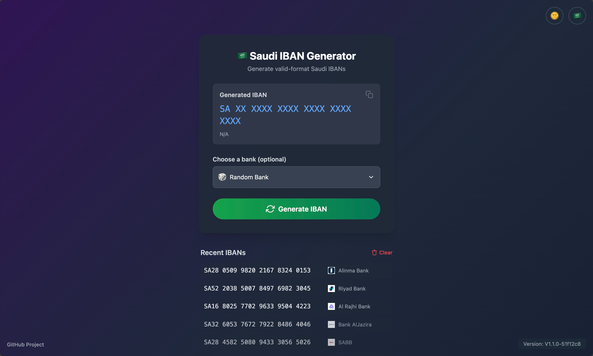

# 🇸🇦 Saudi IBAN Generator


🔗 [Live Demo](https://saudi-iban-generator.onrender.com/)

## ✨ Features

- 🔢 Generate valid **Saudi IBANs**
- 🏦 Choose or randomize banks (with logos)
- 🧠 Auto-detect and display **bank name**
- 📋 One-click **copy to clipboard** with feedback
- 🕓 Store and display **recent IBANs** (localStorage)
- 🌙 Fully supports **dark/light mode** with OS theme detection
- 🌐 Supports **English & Arabic** with RTL switching
- 🎨 Animated UI using **Tailwind CSS** + **Alpine.js**
- 💳 Generate valid **Saudi credit card numbers**
- 🗂️ Tabbed interface for IBAN and card generators
- 🕓 Store and display history of generated cards

## 🖼️ Preview



## 🎈 Usage

1. Use the tabs at the top to switch to **Credit Card Generator**.
2. Click **Generate Card** to create a random Saudi Visa number.
3. Press **Copy** to copy the card number to your clipboard.
4. Generated cards are saved in your card history.

---

## 🛠️ How It Works

- The app generates a valid Saudi IBAN by constructing a BBAN (Basic Bank Account Number) based on the selected or random bank code and a randomly generated account number.
- The IBAN check digits are calculated using the standard modulo 97 method.
- The selected bank's logo and name are displayed and stored alongside the IBAN in the local history (stored in localStorage).
- The app uses Alpine.js for interactivity and Tailwind CSS for styling and transitions.

---

## 🌍 Localization

- The app supports both English and Arabic.
- It automatically adjusts the layout for right-to-left (RTL) display when Arabic is selected.
- Language preference is stored in localStorage for persistence across sessions.

---


## 🧰 Tech Stack

- **Frontend**: HTML, Tailwind CSS (CDN), Alpine.js (CDN)
- **No Backend Required**: Pure static app

---

## 🚀 Deployment Options

This is a static app. You can deploy it with:

- GitHub Pages
- Netlify
- Render
- Vercel

### Deployment Settings

#### 🔹 Render
- Type: Static Site
- Build command: *(leave blank)*
- Publish directory: `public`

#### 🔹 GitHub Pages
- Use `public` folder as the source
- Recommended: `gh-pages` branch or GitHub Actions

#### 🔹 Netlify
- Build command: *(leave blank)*
- Publish directory: `public`

#### 🔹 Vercel
- Output directory: `public`
- Preset: Other

---

## ▶️ Running Locally

```bash
cd public
python3 -m http.server 8080
# Then open http://localhost:8080 in your browser
```

Or just open `public/index.html` directly.


---

## 🧪 Testing & Bundling

Run `npm test` to execute the Jest suite. Helper modules in `src/` are CommonJS files used primarily for these tests.

To make the credit card generator available in the browser, run `npm run build`. This bundles `src/creditCard.js` to `public/creditCard.js` and exposes a global `CreditCard` object.

---

## 🤝 Contributing

Contributions are welcome! If you have suggestions, improvements, or bug fixes, please fork the repo and open a pull request.

1. Fork this repository
2. Create a branch: `git checkout -b feature/YourFeature`
3. Commit your changes: `git commit -m 'Add your message'`
4. Push to your branch: `git push origin feature/YourFeature`
5. Open a pull request

Please ensure your code is clean and adheres to the existing style.
